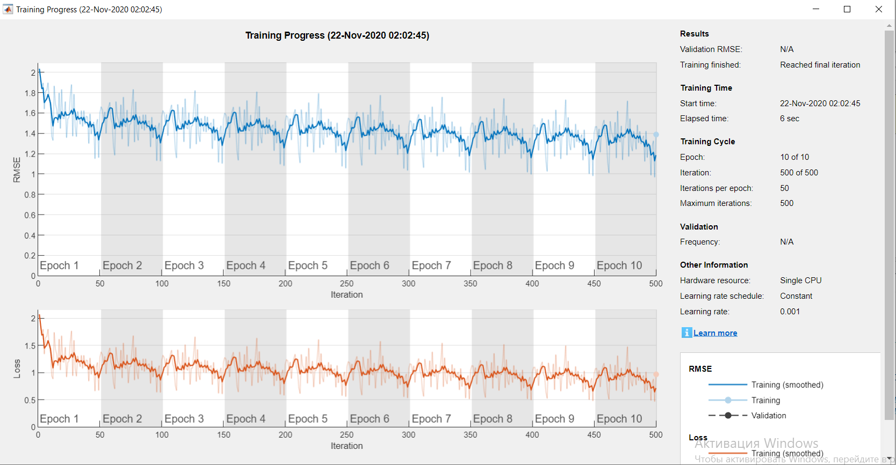
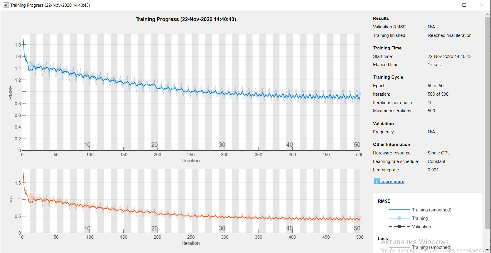

# 3D-Manipulator-IK-NN

## Goal: Build a Neural Network for 5 DOF Manipulator Inverse Kinematcs

#### Initially with only one hidden layer and leakyRelu activation function the accuracy was 45%.

#### With maxEpochs = 10  and miniBatchSize = 100 the minimum accuracy (29%) was with 3 hidden layers with 256:512:256 neurons.

#### Additionally changing the activation function to reLu did not decrease the accuracy, therefore LeakyRelu was chosen as the best fit activation layer.

#### INcreasing the number of hidden layers and neurons also did not help to improve the NN, so the we tried to reduce error by tuning the training options.

#### I tried to change the optimizer function, added L2Regularization and changed the value of epochs:

maxEpochs = 50;
miniBatchSize = 500; 

#### These changes helped to reduce an error to 20%

#### Finally the network with 4 hidden layers with 256:512:512:256 neurons, LeakyRelu activation function was chosen as the best architecture with an accuracy of 19%. 

## 
| #	| NN	| activation	| a|
|-----|----|-----|----|
| 1	| 1(512) |	leakyReLu| 	0,4561	
| 2	| 3(512:1024:512)	| leakyReLu |	0,3883	
| 3	| 3 (256:512:256)	| leakyReLu	|0,299	
| 4	| 5(256:512:1024:512:256)	| leakyReLu	| 0,3691	
| 5	 | 5(512:1024:2048:1024:512)	| leakyReLu |	0,3578	
| 6	| 3(512:1024:512)	| reLu	| 0,3609	
| 7 |	3(512:1024:512)	| reLu	|	sigmoid
|8	| 7(512:1024:2048:4096:2048:1024:512)	| leakyReLu	| 0,374	
|9	| 5(1024:2048:4096:2048:1024)	| leakyReLu	| 0,4084	
|10	| 5(128:256:128:2048:1024) |	leakyReLu | 0,37	
|11	| 3(128:256:128) | 	leakyReLu	|0,332	
|12	| 4(128:256:256:128)	| leakyReLu	|0,3745	
|13	| 4(256:512:512:256)	| leakyReLu	| 0,1948|	epoch
|14	| 4(256:512:1024:512:256)	| leakyReLu	| 0,2699	
|15	| 3 (256:512:256)	| leakyReLu	| 0,207	
|16	| 3(128:256:128)	| leakyReLu	| 0,2403	
|17	| 4(256:512:512:256)	| leakyReLu | 	0,1948	
|18 |	4(128:256:256:128)	| leakyReLu | 	0,2462	

## initial NN with 1 hidden layer

## final NN with 4 hidden layers

You can find figures of training each architecture in figures file.
